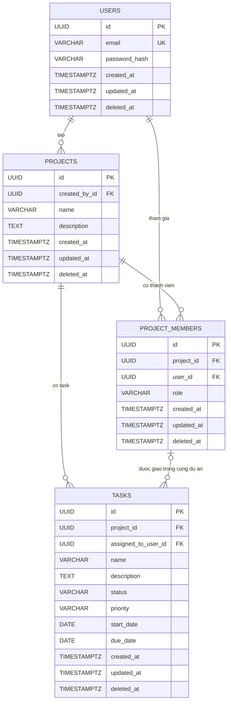

# Thiết kế cơ sở dữ liệu (ERD)

## 1. Quyết định thiết kế

- **Khóa định danh:** dùng UUID cho khóa chính của tất cả bảng. UUID khó đoán hơn số tự tăng khi xuất hiện trong URL; đổi lại, mỗi ID chiếm nhiều dung lượng hơn. Với PostgreSQL có thể sinh ID bằng `gen_random_uuid()`.
- **Xoá mềm:** dùng `deleted_at TIMESTAMPTZ NULL`; `NULL` nghĩa là bản ghi đang hoạt động. API thông thường chỉ truy vấn bản ghi chưa bị xoá. Xoá dự án không xoá dây chuyền task; xoá thành viên đánh dấu membership đã xoá để thu hồi quyền ngay.
- **Thời gian:** tất cả bảng có `created_at` và `updated_at` kiểu `TIMESTAMPTZ NOT NULL DEFAULT now()`, lưu theo UTC. `updated_at` được cập nhật mỗi khi bản ghi thay đổi.
- **Vai trò, trạng thái và mức ưu tiên:** lưu dạng chuỗi với `CHECK` để giới hạn giá trị hợp lệ. Cách này không cần tạo kiểu enum riêng và vẫn giữ ràng buộc ở cơ sở dữ liệu.
- **Email:** chuẩn hoá email về chữ thường trước khi lưu và áp dụng `UNIQUE` để không cho tạo tài khoản trùng email.
- **Mô tả dự án:** `projects.description` là trường `TEXT NULL` để lưu thông tin tóm tắt dự án; không bắt buộc khi tạo nhưng hỗ trợ mô tả rõ hơn cho UX.
- **`deleted_at` của users:** giữ lại để tương lai có thể vô hiệu hoá tài khoản mà không xóa dữ liệu lịch sử; hiện tại chưa có story nghiệp vụ nào dùng nó, nên chỉ coi là trường dự phòng cho tương lai.

ERD và ràng buộc dưới đây dùng cú pháp/kiểu dữ liệu tương thích PostgreSQL.

## 2. Sơ đồ ERD



`assigned_to_user_id` có thể `NULL` nếu task chưa được giao. Quan hệ cuối trong sơ đồ được bảo đảm bằng khóa ngoại ghép `(project_id, assigned_to_user_id)` tới `(project_id, user_id)` của `PROJECT_MEMBERS`.

## 3. Bảng và ràng buộc

### `users`

| Cột             | Kiểu           | Ràng buộc / ý nghĩa                                     |
| --------------- | -------------- | ------------------------------------------------------- |
| `id`            | `UUID`         | PK, mặc định `gen_random_uuid()`                        |
| `email`         | `VARCHAR(320)` | NOT NULL, UNIQUE; lưu email đã chuẩn hoá chữ thường     |
| `password_hash` | `TEXT`         | NOT NULL; chỉ lưu hash mật khẩu, không lưu mật khẩu gốc |
| `created_at`    | `TIMESTAMPTZ`  | NOT NULL DEFAULT `now()`                                 |
| `updated_at`    | `TIMESTAMPTZ`  | NOT NULL DEFAULT `now()`                                 |
| `deleted_at`    | `TIMESTAMPTZ`  | NULL nếu tài khoản chưa bị xoá mềm; trường dự phòng cho tương lai |

### `projects`

| Cột             | Kiểu           | Ràng buộc / ý nghĩa                                            |
| --------------- | -------------- | -------------------------------------------------------------- |
| `id`            | `UUID`         | PK, mặc định `gen_random_uuid()`                               |
| `created_by_id` | `UUID`         | NOT NULL, FK → `users.id`; người tạo dự án                     |
| `name`          | `VARCHAR(200)` | NOT NULL, không rỗng sau khi trim                              |
| `description`   | `TEXT`         | NULL; mô tả dự án, hỗ trợ thêm ngữ cảnh cho project           |
| `created_at`    | `TIMESTAMPTZ`  | NOT NULL DEFAULT `now()`                                       |
| `updated_at`    | `TIMESTAMPTZ`  | NOT NULL DEFAULT `now()`                                       |
| `deleted_at`    | `TIMESTAMPTZ`  | NULL nếu dự án chưa bị xoá mềm                                 |

`created_by_id` là người tạo ban đầu và không đổi; vai trò hiện tại của người đó trong dự án được xác định từ `project_members` đang hoạt động. Người tạo dự án được thêm vào `project_members` với vai trò `owner` trong cùng giao dịch. Trong MVP, API `PATCH` vai trò không được phép gán `owner`; không có luồng "chuyển quyền sở hữu".

### `project_members`

Đây là bảng trung gian biểu diễn quan hệ nhiều-nhiều giữa người dùng và dự án, đồng thời lưu vai trò của người dùng trong từng dự án.

| Cột          | Kiểu          | Ràng buộc / ý nghĩa                                        |
| ------------ | ------------- | ---------------------------------------------------------- |
| `id`         | `UUID`        | PK, mặc định `gen_random_uuid()`                           |
| `project_id` | `UUID`        | NOT NULL, FK → `projects.id`                               |
| `user_id`    | `UUID`        | NOT NULL, FK → `users.id`                                  |
| `role`       | `VARCHAR(20)` | NOT NULL, `CHECK (role IN ('owner', 'manager', 'member'))` |
| `created_at` | `TIMESTAMPTZ` | NOT NULL DEFAULT `now()`                                  |
| `updated_at` | `TIMESTAMPTZ` | NOT NULL DEFAULT `now()`                                  |
| `deleted_at` | `TIMESTAMPTZ` | NULL nếu membership còn hoạt động                          |

- `UNIQUE (project_id, user_id)` ngăn một người có nhiều membership cho cùng dự án. Khi thêm lại thành viên đã bị xoá mềm, kích hoạt lại membership cũ thay vì tạo dòng trùng.
- `UNIQUE (project_id, user_id)` cũng là khóa đích cho FK ghép từ task, nhờ đó người được giao phải có membership trong đúng dự án.
- Mỗi dự án phải có đúng một membership `owner` đang hoạt động. Tạo/chuyển vai trò phải được thực hiện trong giao dịch để luôn giữ invariant này. Có thể dùng partial unique index để ngăn nhiều Owner:

```sql
CREATE UNIQUE INDEX uq_project_members_active_owner
    ON project_members (project_id)
    WHERE role = 'owner' AND deleted_at IS NULL;
```

### Index

```sql
-- Liệt kê dự án của một người dùng (UNIQUE project_id,user_id không phục vụ chiều này)
CREATE INDEX ix_project_members_user ON project_members (user_id) WHERE deleted_at IS NULL;

-- Liệt kê task theo dự án, đúng thứ tự phân trang
CREATE INDEX ix_tasks_project_created ON tasks (project_id, created_at DESC, id DESC) WHERE deleted_at IS NULL;

-- Lọc theo trạng thái
CREATE INDEX ix_tasks_project_status ON tasks (project_id, status) WHERE deleted_at IS NULL;
```

- `ix_project_members_user`: cần cho query "danh sách dự án của user" hoặc "xác định user có tham gia project nào", vì truy vấn theo `user_id` là chiều đọc chính và bị chậm khi bảng lớn.
- `ix_tasks_project_created`: cần cho endpoint `GET /projects/{id}/tasks` theo thứ tự mới nhất trước để hỗ trợ phân trang ổn định, đồng thời tránh quét toàn bộ task table.
- `ix_tasks_project_status`: cần cho bộ lọc `status` trong danh sách task, vì SQL sẽ truy vấn theo `(project_id, status)` mà không cần đọc hàng thừa.

### `tasks`

| Cột                   | Kiểu           | Ràng buộc / ý nghĩa                                                    |
| --------------------- | -------------- | ---------------------------------------------------------------------- |
| `id`                  | `UUID`         | PK, mặc định `gen_random_uuid()`                                       |
| `project_id`          | `UUID`         | NOT NULL, FK → `projects.id`                                           |
| `assigned_to_user_id` | `UUID`         | NULL nếu chưa giao; FK ghép với `project_members(project_id, user_id)` |
| `name`                | `VARCHAR(200)` | NOT NULL, không rỗng sau khi trim                                      |
| `description`         | `TEXT`         | Mô tả task, có thể NULL                                                |
| `status`              | `VARCHAR(20)`  | NOT NULL, mặc định `pending`; CHECK giá trị bên dưới                   |
| `priority`            | `VARCHAR(20)`  | NOT NULL, mặc định `medium`; CHECK giá trị bên dưới                    |
| `start_date`          | `DATE`         | Ngày bắt đầu dự kiến, có thể NULL                                      |
| `due_date`            | `DATE`         | Ngày kết thúc dự kiến, có thể NULL                                     |
| `created_at`          | `TIMESTAMPTZ`  | NOT NULL DEFAULT `now()`                                               |
| `updated_at`          | `TIMESTAMPTZ`  | NOT NULL DEFAULT `now()`                                               |
| `deleted_at`          | `TIMESTAMPTZ`  | NULL nếu task chưa bị xoá mềm                                          |

Các ràng buộc:

```sql
CHECK (status IN ('pending', 'in_progress', 'completed', 'cancelled'))
CHECK (priority IN ('low', 'medium', 'high'))
CHECK (start_date IS NULL OR due_date IS NULL OR due_date >= start_date)
FOREIGN KEY (project_id, assigned_to_user_id)
    REFERENCES project_members (project_id, user_id)
```

Foreign key đảm bảo người được giao thuộc cùng dự án, nhưng không thể bảo đảm membership chưa bị xoá mềm. Khi tạo hoặc đổi người được giao, ứng dụng phải kiểm tra membership có `deleted_at IS NULL`; nếu không hợp lệ, trả `422`. Quyết định nghiệp vụ: khi thành viên bị xoá khỏi dự án, task vẫn giữ nguyên `assigned_to_user_id` để không mất lịch sử giao việc; API task có thể trả `assigned_to_user_id` và `assigned_to_user` là `null` hoặc không có dữ liệu vì người đó không còn trong dự án, nhưng không tự động đưa task về "chưa giao". Luồng chuyển trạng thái cũng là quy tắc nghiệp vụ cần kiểm tra trong ứng dụng:

- `pending` → `in_progress` hoặc `cancelled`
- `in_progress` → `pending`, `completed` hoặc `cancelled`
- `completed` → `in_progress`
- `cancelled` → `pending`

Gửi lại trạng thái hiện tại là thao tác idempotent. Các API đọc task chỉ trả task chưa bị xoá mềm và thuộc dự án chưa bị xoá mềm; dữ liệu task vẫn được giữ khi xoá dự án.

## 4. Quan hệ và lực lượng

- Một `user` có thể tạo nhiều `projects`; mỗi project có một người tạo.
- `users` và `projects` có quan hệ nhiều-nhiều qua `project_members`; mỗi membership thuộc đúng một user và một project, với một vai trò.
- Một `project` có thể có nhiều `tasks`; mỗi task thuộc đúng một project.
- Một task có thể chưa được giao hoặc được giao cho một thành viên của chính project đó. Thành viên đã bị thu hồi vẫn có thể còn được tham chiếu trong lịch sử task; ứng dụng không cho phép giao task mới cho membership đã bị xoá mềm.
- Xoá mềm không thực hiện `ON DELETE CASCADE`; không xoá vật lý các dòng liên quan trong luồng API thông thường.
